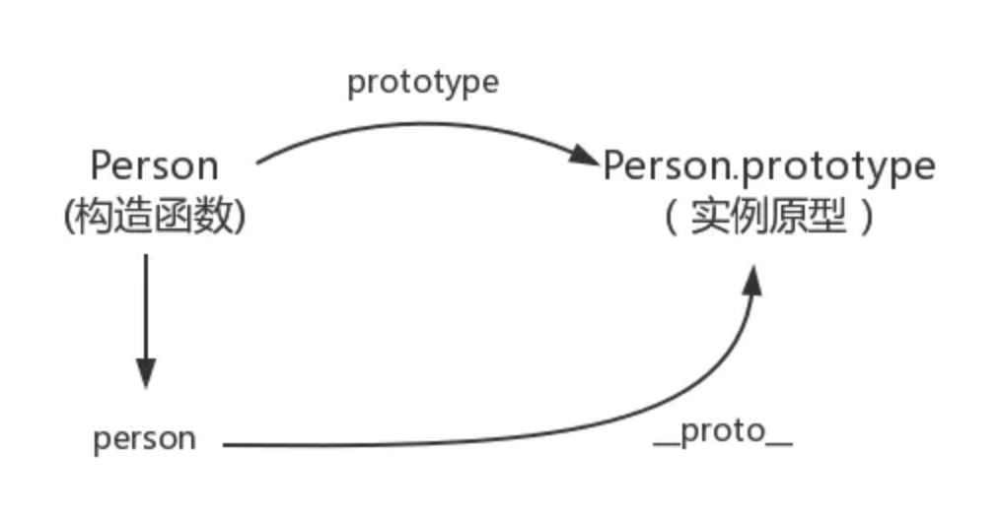
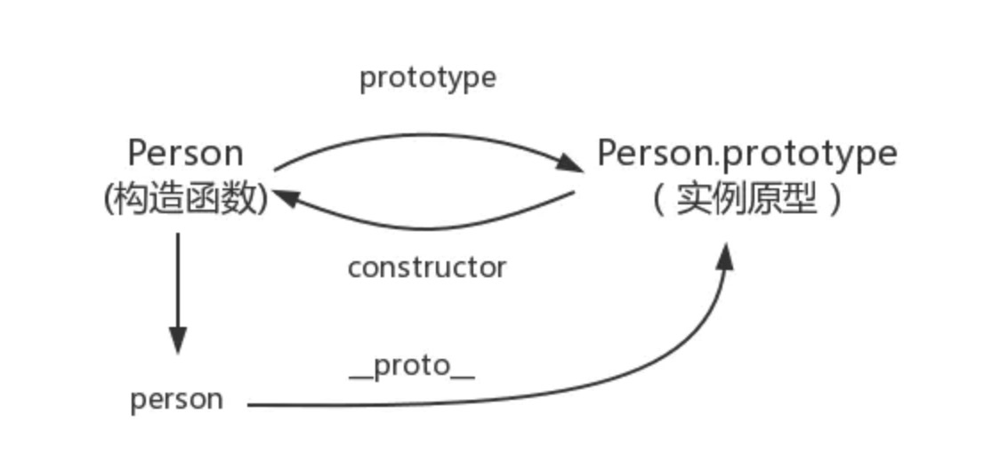
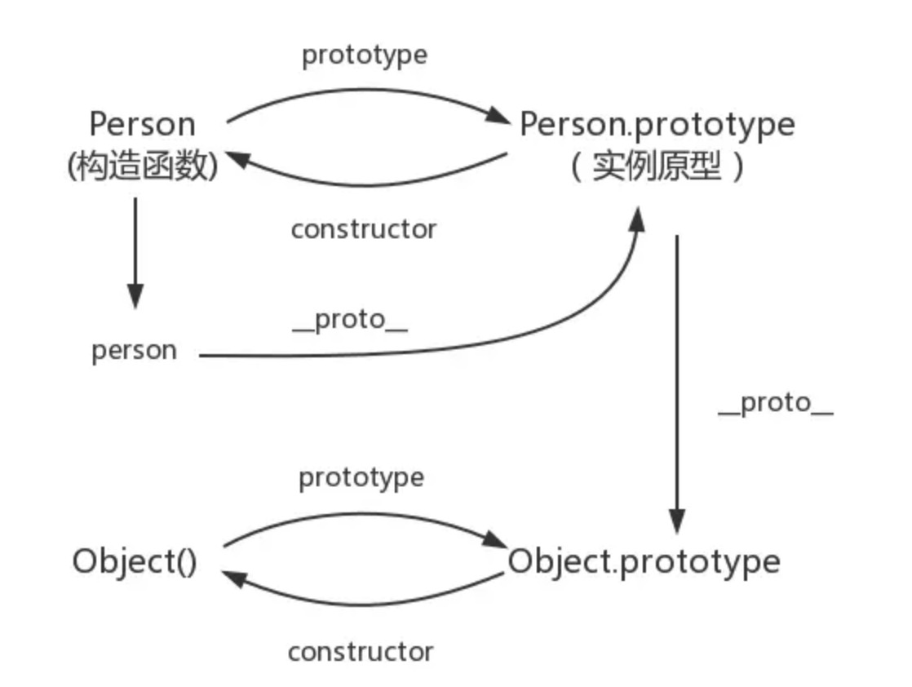

# js小知识点

以下为本人平时总结的js小知识点。<br/>

## 闭包及应用
概念：<br/>
闭包就是能够读取其他函数内部变量的函数，说白了闭包就是个函数，只不过是处于其他函数内部而已。<br/>
用途：<br/>
1.访问函数内部的变量<br/>
2.防止函数内部的变量执行完成后，被销毁，使其一直保存在内存中。<br/>
缺点：<br/>
不适合的场景：返回闭包的函数是非常大的函数
缺点常驻内存，会增大内存的使用量，使用不当造成内存泄漏<br/>

## for..in 和 object.keys的区别
使用for..in循环时，返回的是所有能够通过对象访问的、可枚举的属性，既包括存在于实例中的属性，也包括存在于原型中的实例<br/> Object.keys()用于获取对象自身所有的可枚举的属性值，但不包括原型中的属性，然后返回一个由属性名组成的数组。<br/>

## 数组判断
1、instanceof：obj instanceof Array<br/>
2、Array对象的 isArray方法：Array.isArray(obj)<br/>
3、Object.prototype.toString：Object.prototype.toString.call(obj) === '[object Array]'<br/>


## 事件委托
一步一步来说说事件委托（或者有的资料叫事件代理）<br/>
1、js中事件冒泡我们知道，子元素身上的事件会冒泡到父元素身上。<br/>
2、事件代理就是，本来加在子元素身上的事件，加在了其父级身上。<br/>
3、那就产生了问题：父级那么多子元素，怎么区分事件本应该是哪个子元素的？<br/>
4、答案是：event对象里记录的有“事件源”，它就是发生事件的子元素。<br/>
5、它存在兼容性问题，在老的IE下，事件源是 window.event.srcElement，其他浏览器是 event.target<br/>
用事件委托有什么好处呢？<br/>
1、第一个好处是效率高，比如，不用for循环为子元素添加事件了<br/>
2、只在内存中开辟了一块空间，节省资源同时减少了DOM操作，提供性能<br/>
3、第二个好处是，js<b>新生成的子元素</b>也不用新为其添加事件了，程序逻辑上比较方便<br/>

阻止冒泡：

防止事件冒泡的一种方法是使用 event.cancelBubble 或 event.stopPropagation()（低于 IE 9）


## 数组和类数组
1、类数组定义<br/>
&nbsp;&nbsp;&nbsp;&nbsp;1）拥有length属性，其它属性（索引）为非负整数（对象中的索引会被当做字符串来处理）；<br/>
&nbsp;&nbsp;&nbsp;&nbsp;2）不具有数组所具有的方法；<br/>
2、类数组转换为数组<br/>
&nbsp;&nbsp;&nbsp;&nbsp;1）args = Array.prototype.slice.call(arguments)<br/>
&nbsp;&nbsp;&nbsp;&nbsp;2）[...arrayLike]<br/>
&nbsp;&nbsp;&nbsp;&nbsp;3）Array.from(arrayLike)<br/>

## 数组最大值
var arr = [1, 2, 3, 2, 1];<br/>
1、es6拓展运算符 Math.max(...arr)<br/>
2、es5 apply Math.max.apply(null,arr)<br/>
3、for循环<br/>
4、数组sort()后取arr[0]<br/>
5、数组reduce arr.reduce((num1, num2) => {return num1 > num2 ? num1 : num2})<br/>

## 数组去重
1、利用ES6 Set去重（ES6中最常用） Array.from(new Set(arr))<br/>
2、利用for嵌套for，然后splice去重（ES5中最常用）<br/>
```js
function unique(arr){ 
 for(var i=0; i<arr.length; i++){
 for(var j=i+1; j<arr.length; j++){
 if(arr[i]==arr[j]){ //第一个等同于第二个，splice方法删除第二个
  arr.splice(j,1);
  j--;
 }
 }
 }
return arr;
}
var arr = [1,1,'true','true',true,true,15,15,false,false, undefined,undefined, null,null, NaN, NaN,'NaN', 0, 0, 'a', 'a',{},{}];
 console.log(unique(arr))
 //[1, "true", 15, false, undefined, NaN, NaN, "NaN", "a", {…}, {…}] //NaN和{}没有去重，两个null直接消失了
```
双层循环，外层循环元素，内层循环时比较值。值相同时，则删去这个值。<br/>
3、利用indexOf去重<br/>
```js
function unique(arr) {
 if (!Array.isArray(arr)) {
 console.log('type error!')
 return
 }
 var array = [];
 for (var i = 0; i < arr.length; i++) {
 if (array .indexOf(arr[i]) === -1) {
 array .push(arr[i])
 }
 }
 return array;
}
var arr = [1,1,'true','true',true,true,15,15,false,false, undefined,undefined, null,null, NaN, NaN,'NaN', 0, 0, 'a', 'a',{},{}];
console.log(unique(arr))
 // [1, "true", true, 15, false, undefined, null, NaN, NaN, "NaN", 0, "a", {…}, {…}] //NaN、{}没有去重
```
新建一个空的结果数组，for 循环原数组，判断结果数组是否存在当前元素，如果有相同的值则跳过，不相同则push进数组。<br/>
4、利用sort()<br/>
```js
function unique(arr) {
 if (!Array.isArray(arr)) {
 console.log('type error!')
 return;
 }
 arr = arr.sort()
 var arrry= [arr[0]];
 for (var i = 1; i < arr.length; i++) {
 if (arr[i] !== arr[i-1]) {
 arrry.push(arr[i]);
 }
 }
 return arrry;
}
 var arr = [1,1,'true','true',true,true,15,15,false,false, undefined,undefined, null,null, NaN, NaN,'NaN', 0, 0, 'a', 'a',{},{}];
 console.log(unique(arr))
// [0, 1, 15, "NaN", NaN, NaN, {…}, {…}, "a", false, null, true, "true", undefined] //NaN、{}没有去重
```
利用sort()排序方法，然后根据排序后的结果进行遍历及相邻元素比对。<br/>
5、利用对象的属性不能相同的特点进行去重（这种数组去重的方法有问题，不建议用，有待改进）<br/>
```js
function unique(arr) {
 if (!Array.isArray(arr)) {
 console.log('type error!')
 return;
 }
 arr = arr.sort()
 var arrry= [arr[0]];
 for (var i = 1; i < arr.length; i++) {
 if (arr[i] !== arr[i-1]) {
 arrry.push(arr[i]);
 }
 }
 return arrry;
}
 var arr = [1,1,'true','true',true,true,15,15,false,false, undefined,undefined, null,null, NaN, NaN,'NaN', 0, 0, 'a', 'a',{},{}];
 console.log(unique(arr))
// [0, 1, 15, "NaN", NaN, NaN, {…}, {…}, "a", false, null, true, "true", undefined] //NaN、{}没有去重
```
6、[...new Set(arr)]<br/>

## js异步提交form表单之serialize()方法及FormData对象
serialize()和FormData对象都可将表单数据序列化，后通过ajax异步提交，但二者有实质区别：<br/>
1 serialize()<br/>
serialize()是JQuery方法，可序列化表单值创建 URL 编码文本字符串，就是将表单数据以字符串的形式返回。<br/>
缺点：只能序列化一般数据，文件上传则无法序列化。<br/>
用法：var form = $("#form").serialize();<br/><br/>
2 FormData对象<br/>
FormData是HTML5对象，目前可兼容大多主流的浏览器，但不兼容低版本IE浏览器。<br/>
与普通的Ajax相比，使用FormData 的最大优点就是可以异步上传二进制文件。<br/>
用法1：模拟表单<br/>
```js
var formData = new FormData();
formData.append("name","zhangsna");
formData.append("age","16");
// formData.append('student.telephone', this.telephone)  // 嵌套形式
```
这种效果相当于两个表单中input的提交<br/>
用法2：通过ajax异步提交表单数据，可实现文件上传。<br/>
```js
<form id="form" enctype="multipart/form-data">
    <input type="text" name="name" value="">
    <input type="text" name="age" value="">
    <input type="file" name="file" >
    <button οnclick="toSubmit()">提交</button>
</form>
<script>
    function toSubmit() {
        var formData = new FormData($("#form")[0]);
        $.ajax({
            type: "POST",
            url: "",
            data: formData,
            processData: false,// 不加会报错
            contentType: false,// 不加会报错
            success: function (res) {
                console.log(res);
            }
        });
    }
</script>
```
::: warning 注意
1 form表单加 enctype="multipart/form-data"；2 ajax加 processData: false,contentType: false
:::

## 基本数据类型与引用数据类型
基本数据类型：string, number, boolean, null, undefined。<br/>
<b>基本数据类型</b><br/>
说明：<br/>
   基本数据类型的变量是保存在栈内存中的，基本数据类型的值直接在栈内存中存储，值与值之间是独立存在的，修改一个变量不会影响其他的变量。<br/>
比较：<br/>
   当比较两个基本数据类型的值时，本质上是比较值<br/><br/>
<b>引用数据类型</b><br/>
说明：<br/>
   对象是保存在堆内存中的，每创建一个新的对象，就会在堆内存中开辟出一个新的空间，而变量保存的是对象的内存地址(对象的引用)，如果两个变量保存的是同一个对象引用，当修改其中一个变量修改属性时，另一个也会受到影响。<br/>
比较：<br/>
   当比较两个引用数据类型时，本质上是比较的对象的内存地址，如果两个对象的属性是一模一样的，但是地址不同，也会返回false。<br/>

<b>内存分配和垃圾回收</b><br/>
一般来说栈内存线性有序存储，容量小，系统分配效率高。而堆内存首先要在堆内存新分配存储区域，之后又要把<b>指针存储到栈内存中</b>，效率相对就要低一些了。<br/>
垃圾回收方面，栈内存变量基本上用完就回收了，而推内存中的变量因为存在很多不确定的引用，只有当所有调用的变量全部销毁之后才能回收。<br/>

## JS引擎执行有那几个阶段
浏览器首先按顺序加载由script标签分割的js代码块，加载js代码块完毕后，立刻进入以下三个阶段，然后再按顺序查找下一个代码块，再继续执行以下三个阶段，无论是外部脚本文件（不异步加载）还是内部脚本代码块，都是一样的原理，并且都在同一个全局作用域中。<br/>
<br/>
JS引擎线程的执行过程的三个阶段：<br/>
<br/>
语法分析<br/>
预编译阶段<br/>
执行阶段<br/>
<br/>
详细参见：https://blog.csdn.net/qappleh/article/details/88115997

## 介绍下数字签名的原理
数字签名(签名)则是根据消息内容生成一串　“只有自己才能计算出来的数值”, 因此数字签名(签名)的内容是随消息的改变而改变的。<br/>
生成消息签名:<br/>
根据消息内容计算数字签名的值,这个意味着 “我认可该消息的内容”。<br/>
验证数字签名:<br/>
检查该消息的签名是否真的属于Alice,验证结果可以是成功或者失败,成功意味着这个签名属于Alice,<br/>
失败意味着这个签名不属于Alice的。<br/><br/>

数字签名对签名密钥和验证密钥作了区分,使用验证密钥是无法生成签名的。<br/>
这一点至关重要。<br/>
签名密钥只能由签名的人持有,而验证密钥<br/>
则是任何人需要验证签名的人<br/>
都可以持有！<br/><br/>

数字签名中也同样会使用公钥和私钥组成的密码对,不过两个密钥的用法和公钥密码<br/>
是相反的,即用私钥加密x相当于签名,而公钥解密则相当于验证签名。<br/><br/>

数字签名意义<br/>
只有持有该密钥的人才能够生成的消息。<br/>
这样的信息一般称为认证符号(authenticator),消息认证码也是认证符号的一种。<br/>
数字签名也是通过私钥进行加密来<br/>
产生认证符号的。<br/>

## target和currentTarget的区别
* target在事件流的<b>目标阶段</b>
* currentTarget在事件流的<b>捕获、目标及冒泡阶段</b>
只有当事件流处于目标阶段的时候，两个的指向才是一样的，而处于捕获和冒泡阶段的时候，target指向被单击的对象，而currentTarget指向当前事件活动的对象（注册该事件的对象，一般为父级）。

<b>判断点击事件是用户点击触发还是程序触发</b>
```js
function judge(){
	if(event && event.target==event.currentTarget){
		// 点击事件由用户点击触发
	}else {
		// 点击事件由程序调用触发
	}
}
```

## ==和===区别
* ==， 两边值类型不同的时候，要先进行类型转换，再比较
* ===，不做类型转换，类型不同的一定不等。

==类型转换过程：

1. 如果类型不同，进行类型转换
2. 判断比较的是否是 null 或者是 undefined, 如果是, 返回 true .
3. 判断两者类型是否为 string 和 number, 如果是, 将字符串转换成 number
4. 判断其中一方是否为 boolean, 如果是, 将 boolean 转为 number 再进行判断
5. 判断其中一方是否为 object 且另一方为 string、number 或者 symbol , 如果是, 将 object 转为原始类型再进行判断

经典面试题：[] == ![] 为什么是true

转化步骤：

1. !运算符优先级最高，![]会被转为为false，因此表达式变成了：[] == false
2. 根据上面第(4)条规则，如果有一方是boolean，就把boolean转为number，因此表达式变成了：[] == 0
3. 根据上面第(5)条规则，把数组转为原始类型，调用数组的toString()方法，[]转为空字符串，因此表达式变成了：'' == 0
4. 根据上面第(3)条规则，两边数据类型为string和number，把空字符串转为0，因此表达式变成了：0 == 0
5. 两边数据类型相同，0==0为true


## JS异步加载
1. 同步加载<br/>
我们平时使用的最多的一种方式。<br/>
```js
<script src="http://yourdomain.com/script.js"></script>
<script src="http://yourdomain.com/script.js"></script>
```
同步模式，又称阻塞模式，会阻止浏览器的后续处理，停止后续的解析，只有当当前加载完成，才能进行下一步操作。所以默认同步执行才是安全的。但这样如果js中有输出document内容、修改dom、重定向等行为，就会造成页面堵塞。所以一般建议把script标签放在body结尾处，这样尽可能减少页面阻塞。<br/>
2. 异步加载
异步加载又叫非阻塞加载，浏览器在下载执行js的同时，还会继续进行后续页面的处理。主要有三种方式。<br/>
a. 法一 也叫Script DOM Element<br/>
```js
(function(){
    var scriptEle = document.createElement("script");
    scriptEle.type = "text/javasctipt";
    scriptEle.async = true;
    scriptEle.src = "http://cdn.bootcss.com/jquery/3.0.0-beta1/jquery.min.js";
    var x = document.getElementsByTagName("head")[0];
    x.insertBefore(scriptEle, x.firstChild);        
 })();
```
async属性是HTML5中新增的异步支持。此方法被称为Script DOM Element 方法。Google Analytics 和 Google+ Badge 都使用了这种异步加载代码<br/>
```js
(function(){;
    var ga = document.createElement('script'); 
    ga.type = 'text/javascript'; 
    ga.async = true; 
    ga.src = ('https:' == document.location.protocol ? 'https://ssl' : 'http://www') + '.google-analytics.com/ga.js'; 
    var s = document.getElementsByTagName('script')[0]; 
    s.parentNode.insertBefore(ga, s); 
})();
```
但是这种加载方式执行完之前会阻止onload事件的触发，而现在很多页面的代码都在onload时还执行额外的渲染工作，所以还是会阻塞部分页面的初始化处理。<br/>

b. 法二：onload时的异步加载<br/>
```js
(function(){
    if(window.attachEvent){
        window.attachEvent("load", asyncLoad);
    }else{
        window.addEventListener("load", asyncLoad);
    }
    var asyncLoad = function(){
        var ga = document.createElement('script'); 
        ga.type = 'text/javascript'; 
        ga.async = true; 
        ga.src = ('https:' == document.location.protocol ? 'https://ssl' : 'http://www') + '.google-analytics.com/ga.js'; 
        var s = document.getElementsByTagName('script')[0]; 
        s.parentNode.insertBefore(ga, s);
    }
)();
```
这种方法只是把插入script的方法放在一个函数里面，然后放在window的onload方法里面执行，这样就解决了阻塞onload事件触发的问题。<br/>
::: warning 注意
DOMContentLoaded与load的区别。前者是在document已经解析完成，页面中的dom元素可用，但是页面中的图片，视频，音频等资源未加载完，作用同jQuery中的ready事件；后者的区别在于页面所有资源全部加载完毕。
:::

c. 法三：其他方法<br/>
HTML5新属性：async和defer属性<br/>
defer属性：IE4.0就出现。defer属声明脚本中将不会有document.write和dom修改。浏览器会并行下载其他有defer属性的script。而不会阻塞页面后续处理。注：所有的defer脚本必须保证按顺序执行的。<br/>
async属性：HTML5新属性。脚本将在下载后尽快执行，作用同defer，但是不能保证脚本按顺序执行。他们将在onload事件之前完成。
Firefox 3.6、Opera 10.5、IE 9和最新的Chrome和Safari都支持async属性。可以同时使用async和defer，这样IE 4之后的所有IE都支持异步加载。<br/><br/>

没有async属性，script将立即获取（下载）并执行，期间阻塞了浏览器的后续处理。如果有async属性，那么script将被异步下载并执行，同时浏览器继续后续的处理。<br/><br/>

总结： 对于支持HTML5的浏览器，实现JS的异步加载只需要在script元素中加上async属性，为了兼容老版本的IE还需加上defer属性；对于不支持HTML5的浏览器(IE可以用defer实现)，可以采用以上几种方法实现。原理基本上都是向DOM中写入script或者通过eval函数执行JS代码，你可以把它放在匿名函数中执行，也可以在onload中执行，也可以通过XHR注入实现，也可以创建一个iframe元素，然后在iframe中执行插入JS代码。<br/><br/>

3. 延迟加载<br/>
有些JS代码在某些情况在需要使用，并不是页面初始化的时候就要用到。延迟加载就是为了解决这个问题。将JS切分成许多模块，页面初始化时只加载需要立即执行的JS，然后其它JS的加载延迟到第一次需要用到的时候再加载。类似图片的延迟加载。<br/><br/>

JS的加载分为两个部分：下载和执行。异步加载只是解决了下载的问题，但是代码在下载完成后就会立即执行，在执行过程中浏览器处于阻塞状态，响应不了任何需求。<br/><br/>

解决思路：为了解决JS延迟加载的问题，可以利用异步加载缓存起来，但不立即执行，需要的时候在执行。如何进行缓存呢？将JS内容作为Image或者Object对象加载缓存起来，所以不会立即执行，然后在第一次需要的时候在执行。<br/>
```js
1：模拟较长的下载时间：
利用thread让其sleep一段时间在执行下载操作。
2：模拟较长的JS代码执行时间
var start = Number(new Date());
while(start + 5000 > Number(new Date())){//执行JS}
这段代码将使JS执行5秒才完成！
```
JS延迟加载机制(LazyLoad)：简单来说，就是在浏览器滚动到某个位置在触发相关的函数，实现页面元素的加载或者某些动作的执行。如何实现浏览器滚动位置的检测呢？可以通过一个定时器来实现，通过比较某一时刻页面目标节点位置和浏览器滚动条高度来判断是否需要执行函数。<br/>

## 彻底搞懂 JS 中 this 机制
1. this 是什么<br/>
2. this 的四种绑定规则<br/>
3. 绑定规则的优先级<br/>
4. 绑定例外<br/>
5. 扩展：箭头函数<br/>

### this 是什么
理解this之前， 先纠正一个观点，<b>this 既不指向函数自身，也不指函数的词法作用域</b>。如果仅通过this的英文解释，太容易产生误导了。它实际是在函数被调用时才发生的绑定，也就是说this具体指向什么，取决于你是怎么调用的函数。<br/>
### this 的四种绑定规则
this的4种绑定规则分别是：默认绑定、隐式绑定、显示绑定、new 绑定。优先级从低到高。<br/><br/>

参考来源：https://segmentfault.com/a/1190000014224541

## 箭头函数与普通函数的区别
箭头函数相当于匿名函数，并且简化了函数定义。箭头函数有两种格式，一种只包含一个表达式，连{ ... }和return都省略掉了。还有一种可以包含多条语句，这时候就不能省略{ ... }和return。<br/>
1. 箭头函数是匿名函数，不能作为构造函数，不能使用new<br/>
2. 箭头函数不绑定arguments，取而代之用rest参数...解决<br/>
3. 箭头函数不绑定this，会捕获其所在的上下文的this值，作为自己的this值<br/>
4. 箭头函数通过 call()  或   apply() 方法调用一个函数时，只传入了一个参数，对 this 并没有影响。<br/>
5. 箭头函数没有原型属性<br/>
6. 箭头函数不能当做Generator函数,不能使用yield关键字<br/>
总之：箭头函数的 this 永远指向其上下文的  this ，任何方法都改变不了其指向，如 call() ,  bind() ,  apply() 。普通函数的this指向调用它的那个对象<br/><br/>

参考来源：https://www.cnblogs.com/biubiuxixiya/p/8610594.html<br/>

## JS词法作用域和动态作用域区别
动态作用域不关心函数和作用域是如何声明以及在何处声明的，只关心它们从何处调用。<br/>
作用域链式基于调用栈的，而不是代码中的作用域嵌套。<br/>
需要明确的是，JavaScript并不具有动态作用域，它只有词法作用域，简单明了。但是this机制某种程度上很像动态作用域。<br/>
```js
function foo(){
    console.log(a);//2
}
function bar(){
    var a=3;
    foo();
}
var a=2;
bar();
```
词法作用域 foo() 中的a通过RH引用到了全局作用域中的a，因此会输出2。<br/>
而动态作用域回输出3。<br/>
为什么会这样，因为当foo()无法找到a的变量引用时，会顺着调用栈在调用foo()的地方查找a,而不是在嵌套的词法作用域中向上查找。由于foo()是在bar()中调用的，引擎会检查bar()的作用域，并在其中找到值为3的变量a。<br/><br/>
主要区别：<br/>
<b>词法作用域是在写代码或者说定义时确定的，而动态作用域是在运行时确定的</b>。<br/>
<b>词法作用域关注函数在何处声明，而动态作用域关注函数从何处调用</b>。<br/>

## bind、call、apply
三者都是用于改变函数体内this的指向，但是bind与apply和call的最大的区别是：bind不会立即调用，而是返回一个新函数，称为绑定函数，其内的this指向为创建它时传入bind的第一个参数，而传入bind的第二个及以后的参数作为原函数的参数来调用原函数。<br/>
```js
var obj = {};
function test() {
    console.log(this === obj);
}
test(); //false
var testObj = test.bind(obj);
testObj();  //true
```
apply和call都是为了改变某个函数运行时的上下文而存在的（就是为了改变函数内部this的指向）；apply和call的调用返回函数执行结果<br/>
如果使用apply或call方法，那么this指向他们的第一个参数，apply的第二个参数是一个参数数组，call的第二个及其以后的参数都是数组里面的元素，就是说要全部列举出来。<br/><br/>

来源：https://blog.csdn.net/chengbo_x/article/details/83107808

## js的原型和原型链
### prototype
每个函数都有一个 prototype 属性<br/>
每一个JavaScript对象(null除外)在创建的时候就会与之关联另一个对象，这个对象就是我们所说的原型，每一个对象都会从原型"继承"属性。<br/>
函数的 prototype 属性指向了一个对象，这个对象正是调用该构造函数而创建的实例的原型，也就是这个例子中的 f1 的原型。prototype带有__proto__和constructor<br/>
```js
function Person() {

}
// 虽然写在注释里，但是你要注意：
// prototype是函数才会有的属性
Person.prototype.name = 'Kevin';
var person1 = new Person();
var person2 = new Person();
console.log(person1.name) // Kevin
console.log(person2.name) // Kevin
```
### proto
每一个JavaScript对象(除了 null )都具有的一个属性，叫__proto__，这个属性会指向了创建该对象的构造函数的原型。<br/>
```js
function Person() {

}
var person = new Person();
console.log(person.__proto__ === Person.prototype); // true
```
<br/>

### constructor
每个原型都有一个 constructor 属性指向关联的构造函数  实例原型指向构造函数<br/>
由于实例对象可以继承原型对象的属性，所以实例对象也拥有constructor属性，同样指向原型对象对应的构造函数。<br/>
<br/>

```js
function Person() {

}
var person = new Person();
console.log(person.__proto__ == Person.prototype) // true
console.log(Person.prototype.constructor == Person) // true
// 顺便学习一个ES5的方法,可以获得对象的原型
console.log(Object.getPrototypeOf(person) === Person.prototype) // true
```

### 实例与原型
```js
function Person() {

}
Person.prototype.name = 'Kevin';
var person = new Person();
person.name = 'Daisy';
console.log(person.name) // Daisy
delete person.name;
console.log(person.name) // Kevin
```
在这个例子中，我们给实例对象 person 添加了 name 属性，当我们打印 person.name 的时候，结果自然为 Daisy。<br/><br/>
但是当我们删除了 person 的 name 属性时，读取 person.name，从 person 对象中找不到 name 属性就会从 person 的原型也就是 person.proto ，也就是 Person.prototype中查找，幸运的是我们找到了 name 属性，结果为 Kevin。<br/>

### 原型与原型
```js
var obj = new Object();
obj.name = 'Kevin'
console.log(obj.name) // Kevin
```
<br/>

### 原型链
JS在创建对象（不论是普通对象还是函数对象）的时候，都有一个叫做__proto__的内置属性，用于指向创建它的函数对象的原型对象prototype。<br/>
```js
console.log(Object.prototype.__proto__ === null) // true
```
<br/>
JavaScript 默认并不会复制对象的属性，相反，JavaScript 只是在两个对象之间创建一个关联，这样，一个对象就可以通过委托访问另一个对象的属性和函数，所以与其叫继承，委托的说法反而更准确些<br/>

<!-- 1.每个对象都具有一个名为__proto__的属性；<br/>
2.每个构造函数（构造函数标准为大写开头，如Function()，Object()等等JS中自带的构造函数，以及自己创建的）都具有一个名为prototype的方法（注意：既然是方法，那么就是一个对象（JS中函数同样是对象），所以prototype同样带有__proto__属性）；<br/>
3.每个对象的__proto__属性指向自身构造函数的prototype；<br/>
<br/>
详细参考：<br/>
https://www.jianshu.com/p/be7c95714586<br/>
https://www.jianshu.com/p/72156bc03ac1<br/> -->

## js es6 map 与 原生对象区别
object和Map存储的都是键值对组合<br/>
但是：object的键的类型是字符串;map的键的类型可以是任意类型<br/>
另外注意，object获取键值使用Object.keys（返回数组）；<br/>
Map获取键值使用 map变量.keys() (返回迭代器)。<br/>

## js实现文件切片上传，断点续传
思路很简单，拿到文件，保存文件唯一性标识，切割文件，分段上传，每次上传一段，根据唯一性标识判断文件上传进度，直到文件的全部片段上传完毕。<br/>
参考：https://segmentfault.com/a/1190000009448892<br/>

## Javascript请求性能——防抖和节流
在前端开发中，会有一部分用户的行为会频繁的触发事件执行，而对于DOM操作、资源加载等耗费性能的处理，很有可能造成页面卡顿，甚至浏览器崩溃。函数节流（throttle）和函数防抖（debounce）就是为了处理类似需求应运而生的。<br/>
函数节流（throttle）与 函数防抖（debounce）都是为了限制函数的执行频次，以优化函数触发频率过高导致的响应速度跟不上触发频率，出现延迟，假死或卡顿的现象。<br/>
1. <b>防抖</b><br/>
函数防抖(debounce)：触发高频事件后n秒内函数只会执行一次，如果n秒内高频事件再次被触发，则重新计算时间。<br/>
函数防抖就是函数在频繁需要触发情况时，只有等足够空闲的时间才去执行一次。好像公交车司机等人都上车以后才出站一样。<br/>
比如我们在做搜索框的时候，要根据搜索的内容进行请求查找出相关的内容，此时我们在给输入框绑定oninput事件而不做防抖处理的话，每输入一个字就会进行一次处理。比如我想搜索abc，那就会输入a的时候触发请求数据一次，ab的时候触发请求数据一次，然后才是abc，但往往前两次是不需要的，而且频繁的进行请求也会影响性能，此时我们就需要进行防抖处理。<br/>
实现方式：每次触发事件时设置一个延迟调用方法，并且取消之前的延时调用方法<br/>
缺点：如果事件在规定的时间间隔内被不断的触发，则调用方法会被不断的延迟<br/>
```js
<input type="text" name="search" id="inp">
<script>
    var inp = document.getElementById('inp');
    inp.oninput = debounce(handle, 300);

    function handle(e) {
        console.log(this.value, e);
    }

    /*
        防抖函数：
        handle：需要调用的函数
        delay：延迟时间
    */
    function debounce(handle, delay) {
        var timer = null;
        return function () {
            var _this = this, _arg = arguments;//谁调用此方法,this就指向谁
            clearTimeout(timer);
            timer = setTimeout(function () {
                handle.apply(_this, _arg);
            }, delay);
        }
    }
</script>
```
<br/>

2. <b>节流</b><br/>
函数节流(throttle)：高频事件触发，但在n秒内只会执行一次，所以节流会稀释函数的执行频率。<br/>
函数节流就是预定一个函数只有在大于等于执行周期的时候才去执行，周期内调用不执行。就好像水滴攒到一定程度才会落下。主要应用于：抢购疯狂点击、页面滚动等<br/>
实现方式：每次触发事件时，如果当前有等待执行的延时函数，则直接return<br/>
```js
<div>0</div>
<button id="btn">click</button>
<script>
    var btn = document.getElementById('btn'),
        div = document.getElementsByTagName('div')[0];
    btn.onclick = throttle(handle, 1000);

    function handle() {
        div.innerHTML = parseInt(div.innerHTML) + 1;
    }

    /*
        节流函数
        handle:调用的函数
        wait:等待时间（毫秒）
    */
    function throttle(handle, wait) {
        var lastTime = 0;
        return function () {
            //new Date().getTime()从1970到当前所过去的时间（毫秒）
            var nowTime = new Date().getTime();
            //时间差大于等于等待时间，就去执行函数
            if (nowTime - lastTime >= wait) {
                handle.apply(this, arguments);
                lastTime = nowTime;
            }
        }
    }
</script>
```

## 搜索请求中文如何请求
前台需要对中文参数进行编码，调用js方法encodeURI（url），将url编码，然后请求<br/>

## 通过什么做到并发请求
用Promise，有Promise.all<br/>

## 浏览器事件流向
事件传播的顺序对应浏览器的两种事件流模型：捕获型事件流和冒泡型事件流。<br/>
冒泡型事件流：事件的传播是从最特定的事件目标到最不特定的事件目标。即从DOM树的叶子到根。【推荐】<br/>
捕获型事件流：事件的传播是从最不特定的事件目标到最特定的事件目标。即从DOM树的根到叶子。<br/>

## 事件的委托（代理 Delegated Events）的原理以及优缺点
优点是：<br/>
（1）可以大量节省内存占用，减少事件注册，比如在table上代理所有td的click事件就非常棒<br/>
（2）可以实现当新增子对象时无需再次对其绑定事件，对于动态内容部分尤为合适<br/><br/>
缺点是：<br/>
事件代理的应用常用应该仅限于上述需求下，如果把所有事件都用代理就可能会出现事件误判，即本不应用触发事件的被绑上了事件。<br/>

## js的垃圾回收机制
详细参考：https://www.cnblogs.com/mayun0504/p/10646620.html<br/>


## HTTP相关
### HTTP和HTTPS的基本概念
HTTP：是互联网上应用最为广泛的一种网络协议，是一个客户端和服务器端请求和应答的标准（TCP），用于从WWW服务器传输超文本到本地浏览器的传输协议，它可以使浏览器更加高效，使网络传输减少。<br/>
HTTPS：是以安全为目标的HTTP通道，简单讲是HTTP的安全版，即HTTP下加入SSL层，HTTPS的安全基础是SSL，因此加密的详细内容就需要SSL。<br/>
HTTPS协议的主要作用可以分为两种：一种是建立一个信息安全通道，来保证数据传输的安全；另一种就是确认网站的真实性。<br/>

### HTTP与HTTPS有什么区别？
HTTP协议传输的数据都是未加密的，也就是明文的，因此使用HTTP协议传输隐私信息非常不安全，为了保证这些隐私数据能加密传输，于是网景公司设计了SSL（Secure Sockets Layer）协议用于对HTTP协议传输的数据进行加密，从而就诞生了HTTPS。简单来说，HTTPS协议是由SSL+HTTP协议构建的可进行加密传输、身份认证的网络协议，要比http协议安全。<br/>
HTTPS和HTTP的区别主要如下：<br/>
1、https协议需要到ca申请证书，一般免费证书较少，因而需要一定费用。<br/>
2、http是超文本传输协议，信息是明文传输，https则是具有安全性的ssl加密传输协议。
3、http和https使用的是完全不同的连接方式，用的端口也不一样，前者是80，后者是443。<br/>
4、http的连接很简单，是无状态的；HTTPS协议是由SSL+HTTP协议构建的可进行加密传输、身份认证的网络协议，比http协议安全。<br/>

### HTTP请求包含哪几个部分
#### 请求报文（请求行/请求头/请求数据/空行）
1. 请求行
求方法字段、URL字段和HTTP协议版本
例如：GET /index.html HTTP/1.1
get方法将数据拼接在url后面，传递参数受限
2. 请求方法：
GET、POST、HEAD、PUT、DELETE、OPTIONS、TRACE、CONNECT
3. 请求头：
a. Host (主机和端口号)
b. Connection (链接类型)
c. Upgrade-Insecure-Requests (升级为 HTTPS 请求)
d. User-Agent (浏览器名称)
e. Accept (传输文件类型)
f. Referer (页面跳转处)
g. Accept-Encoding（文件编解码格式）
h. Cookie （Cookie）
i. x-requested-with :XMLHttpRequest (是 Ajax 异步请求)
4. 请求数据
post方法中，会把数据以key value形式发送请求
5. 空行
发送回车符和换行符，通知服务器以下不再有请求头
#### 响应报文（状态行/消息报头/响应正文）

### 一次完整的HTTP请求过程
1. 域名解析
2. 发起TCP的3次握手
3. 建立TCP连接后发起http请求
4. 服务器响应http请求，浏览器得到html代码
5. 浏览器解析html代码，并请求html代码中的资源（如js、css、图片等）
6. 浏览器对页面进行渲染呈现给用户

### 从输入url到显示页面，经历了什么
1. 首先，在浏览器地址栏中输入url。
2. 浏览器先查看浏览器缓存-系统缓存-路由器缓存，如果缓存中有，会直接在屏幕中显示页面内容。若没有，则跳到第三步操作。
3. 在发送http请求前，需要域名解析(DNS解析)(DNS（域名系统，Domain Name System）是互联网的一项核心服务，它作为可以将域名和IP地址相互映射的一个分布式数据库，能够使人更方便的访问互联网，而不用去记住IP地址。)，解析获取相应的IP地址。
4. 浏览器向服务器发起tcp连接，与浏览器建立tcp三次握手。（TCP即传输控制协议。TCP连接是互联网连接协议集的一种。）
5. 握手成功后，浏览器向服务器发送http请求，请求数据包。
6. 服务器处理收到的请求，将数据返回至浏览器。
7. 浏览器收到HTTP响应。
8. 读取页面内容，浏览器渲染，解析html源码。
9. 生成Dom树、解析css样式、js交互。
10. 客户端和服务器交互。
11. ajax查询。

### http1.1时如何复用tcp连接
在HTTP 1.0中，客户端的每一个HTTP请求都必须通过独立的TCP连接进行处理，而在HTTP 1.1中，对这种方式进行了改进。客户端可以在一个TCP连接中发送多个HTTP请求，这种技术叫做HTTP复用（HTTP Multiplexing）。它与TCP连接复用最根本的区别在于，TCP连接复用是将多个客户端的HTTP请求复用到一个服务器端TCP连接上，而HTTP复用则是一个客户端的多个HTTP请求通过一个TCP连接进行处理。前者是负载均衡设备的独特功能；而后者是HTTP 1.1协议所支持的新功能，目前被大多数浏览器所支持。<br/>

### 常见状态码
1. 1XX：通知<br/>
2. 2XX: 成功<br/>
3. 3XX 重定向<br/>
4. 4XX：客户端错误<br/>
5. 5XX 服务端错误<br/>
<br/>
200 OK：表示从客户端发送给服务器的请求被正常处理并返回；<br/>
204 No Content：表示客户端发送给客户端的请求得到了成功处理，但在返回的响应报文中不含实体的主体部分（没有资源可以返回）；<br/>
206 Patial Content：表示客户端进行了范围请求，并且服务器成功执行了这部分的GET请求，响应报文中包含由Content-Range指定范围的实体内容。<br/>
<br/>
301 Moved Permanently：永久性重定向，表示请求的资源被分配了新的URL，之后应使用更改的URL；<br/>
302 Found：临时性重定向，表示请求的资源被分配了新的URL，希望本次访问使用新的URL；<br/>
301与302的区别：前者是永久移动，后者是临时移动（之后可能还会更改URL）<br/>
303 See Other：表示请求的资源被分配了新的URL，应使用GET方法定向获取请求的资源；<br/>
302与303的区别：后者明确表示客户端应当采用GET方式获取资源<br/>
304 Not Modified：表示客户端发送附带条件（是指采用GET方法的请求报文中包含if-Match、If-Modified-Since、If-None-Match、If-Range、If-Unmodified-Since中任一首部）的请求时，服务器端允许访问资源，但是请求为满足条件的情况下返回改状态码；<br/>
307 Temporary Redirect：临时重定向，与303有着相同的含义，307会遵照浏览器标准不会从POST变成GET；（不同浏览器可能会出现不同的情况）；<br/>
<br/>
400 Bad Request：表示请求报文中存在语法错误；<br/>
401 Unauthorized：未经许可，需要通过HTTP认证；<br/>
403 Forbidden：服务器拒绝该次访问（访问权限出现问题）<br/>
404 Not Found：表示服务器上无法找到请求的资源，除此之外，也可以在服务器拒绝请求但不想给拒绝原因时使用；<br/>
<br/>
500 Inter Server Error：表示服务器在执行请求时发生了错误，也有可能是web应用存在的bug或某些临时的错误时；<br/>
503 Server Unavailable：表示服务器暂时处于超负载或正在进行停机维护，无法处理请求；<br/>

## 函数柯里化
```js
/**
 * 函数柯里化
 * 柯里化（Currying）是把接受多个参数的函数变换成接受一个单一参数（最初函数的第一个参数）的函数，并且返回接受余下的参数且返回结果的新函数的技术。
 */
// 通用版
function curry(fn, args) {
    var length = fn.length;
    var args = args || [];
    return function() {
        newArgs = args.concat(Array.prototype.slice.call(arguments))
        console.log(newArgs)
        if(newArgs.length < length) {
            return curry.call(this, fn, newArgs);
        } else {
            return fn.apply(this, newArgs);
        }
    }
}
function multiFn(a, b, c) {
    console.log(a * b * c)
    return a * b * c;
}

var multi = curry(multiFn);
multi(2)(3)(4)
// multi(2, 3, 4)
// multi(2)(3, 4)
// multi(2, 3)(4)
```

## 什么是IIFE（立即调用的函数表达式）
```js
(function IIFE(){
    console.log( "Hello!" );
})();
// "Hello!"
```
常常使用此模式来避免污染全局命名空间，因为在IIFE中使用的所有变量(与任何其他普通函数一样)在其作用域之外都是不可见的。

## 宏任务和微任务
* macro-task(宏任务)：包括整体代码script，setTimeout，setInterval
* micro-task(微任务)：Promise，process.nextTick

不同类型的任务会进入不同的Event Queue，有宏任务的队列和微任务的队列。

事件循环的顺序，决定js代码的执行顺序。进入整体代码(宏任务)后，开始第一次循环。接着执行所有的微任务。然后再次从宏任务开始，找到其中一个任务队列执行完毕，再执行所有的微任务。

* 整段代码作为宏任务进入主线程
* 遇到settimeout，将其回调函数注册后分发到宏任务Event Queue。
* 遇到了Promise，new Promise立即执行，then函数分发到微任务Event Queue
* 遇到console.log()，立即执行
* 第一个宏任务执行结束，看看有什么微任务，发现有then，执行
* 第二轮循环，发现宏任务settimeout的回调函数，执行。
* 结束。

### setTimeout、Promise、Async/Await 的区别

其中settimeout的回调函数放到宏任务队列里，等到执行栈清空以后执行； promise.then里的回调函数会放到相应宏任务的微任务队列里，等宏任务里面的同步代码执行完再执行；async函数表示函数里面可能会有异步方法，await后面跟一个表达式，async方法执行时，遇到await会立即执行表达式，然后把表达式后面的代码放到微任务队列里，让出执行栈让同步代码先执行。


```js
async function async1() {
   console.log('async1 start')
   await async2()
   console.log('async1 end')
}
async function async2() {
   console.log('async2')
}
console.log('script start')
setTimeout(function () {
   console.log('settimeout')
})
async1()
new Promise(function (resolve) {
   console.log('promise1')
   resolve()
}).then(function () {
   console.log('promise2')
})
console.log('script end')

// 答案
script start
async1 start
async2
promise1
script end
async1 end
promise2
settimeout
```


## js“深冻结”对象
如果想要确保对象被深冻结，就必须创建一个递归函数来冻结对象类型的每个属性：

### 没有深冻结
```js
let person = {
    name: 'Leonardo',
    profession: {
        name: 'developer'
    }
};
Object.freeze(person);
peroson.profession.name = 'doctor';
console.log(person);  //output {name: 'Leonardo', profession: {name: 'doctor'} }
```

### 深冻结
```js
function deepFreeze(object) {
    let propNames = Object.getOwnPropertyNames(object);
    for(let name of propNames) {
        let value = object[name];
        object[name] = value && typeof value === 'object' ? deepFreeze(value) : value;
    }
    return Object.freeze(object);
}
let person = {
    name: 'Leonardo',
    profession: {
        name: 'developer'
    }
};
deepFreeze(person);
person.profession.name = 'doctor';
```

## 编写一个可以执行如下操作的函数
```js
var addSix = createBase(6);
addSix(10); // 返回 16
addSix(21);  // 返回 27

function createBase(baseNumber) {
    return function(N) {
        return baseNumber + N;
    }
}
```

## CSS加载会阻塞js运行吗

1. css加载不会阻塞DOM树的解析
2. css加载会阻塞DOM树的渲染
3. css加载会阻塞后面js语句的执行

因此，为了避免让用户看到长时间的白屏时间，我们应该尽可能的提高css加载速度，比如可以使用以下几种方法:

1. 使用CDN(因为CDN会根据你的网络状况，替你挑选最近的一个具有缓存内容的节点为你提供资源，因此可以减少加载时间)
2. 对css进行压缩(可以用很多打包工具，比如webpack,gulp等，也可以通过开启gzip压缩)
3. 合理的使用缓存(设置cache-control,expires,以及E-tag都是不错的，不过要注意一个问题，就是文件更新后，你要避免缓存而带来的影响。其中一个解决防范是在文件名字后面加一个版本号)
4. 减少http请求数，将多个css文件合并，或者是干脆直接写成内联样式(内联样式的一个缺点就是不能缓存)

## ['1', '2', '3'].map(parseInt)
首先让我们回顾一下，map函数的第一个参数callback：

var new_array = arr.map(function callback(currentValue[, index[, array]]) { // Return element for new_array }[, thisArg])

这个callback一共可以接收三个参数，其中第一个参数代表当前被处理的元素，而第二个参数代表该元素的索引。


而parseInt则是用来解析字符串的，使字符串成为指定基数的整数。

parseInt(string, radix)

接收两个参数，第一个表示被处理的值（字符串），第二个表示为解析时的基数。

了解这两个函数后，我们可以模拟一下运行情况

parseInt('1', 0) //radix为0时，且string参数不以“0x”和“0”开头时，按照10为基数处理。这个时候返回1

parseInt('2', 1) //基数为1（1进制）表示的数中，最大值小于2，所以无法解析，返回NaN

parseInt('3', 2) //基数为2（2进制）表示的数中，最大值小于3，所以无法解析，返回NaN

map函数返回的是一个数组，所以最后结果为[1, NaN, NaN]

## 实现new
首先创建一个空的对象，空对象的 ___proto____属性指向构造函数的原型对象
把上面创建的空对象赋值构造函数内部的this，用构造函数内部的方法修改空对象
如果构造函数返回一个非基本类型的值，则返回这个值，否则上面创建的对象

```js
function _new(fn, ...arg) {
    var obj = Object.create(fn.prototype);
    const result = fn.apply(obj, ...arg);
    return Object.prototype.toString.call(result) == '[object Object]' ? result : obj;
}
```

## 算法

### 算法手写题
已知如下数组：

var arr = [ [1, 2, 2], [3, 4, 5, 5], [6, 7, 8, 9, [11, 12, [12, 13, [14] ] ] ], 10];

编写一个程序将数组扁平化去并除其中重复部分数据，最终得到一个升序且不重复的数组

```js
var arr = [[1, 2, 2], [3, 4, 5, 5], [6, 7, 8, 9, [11, 12, [12, 13, [14]]]], 10];
    // 方法一
    console.log(Array.from(new Set(arr.flat(Infinity))).sort((a, b) => a - b))
    // 方法二
    console.log(Array.from(new Set(arr.toString().split(','))).map(Number).sort((a, b) => a - b))

    // 方法三
    // 第一步：扁平化
    let newArr = [];
    function flat(originArr) {
        if ({}.toString.call(originArr) === '[object Array]') {
            for (let i of originArr) {
                if ({}.toString.call(i) === '[object Array]') {
                    arguments.callee(i)
                } else {
                    newArr.push(i)
                }
            }
        }
        return newArr;
    }
    console.log(flat(arr))
    // 第二步：去重
    var newArr1 = [];
    for (let i of newArr) {
        if (!newArr1.includes(i)) newArr1.push(i);
    }
    // 第三步：排序 可以采用相关算法处理
    console.log(newArr1.sort((a, b) => a - b))
```


## 常用设计模式在前端开发中的应用
设计模式，是一套经过前人总结、业务验证并适合于特定业务开发的代码组织方式，可能会有一些同学会认为设计模式没有用，我这里需要指出设计模式并不是万能的只适合于特定业务场景的开发（对我们的业务开发起到一定的指导作用，所有设计模式的目的都是让开发者编写可维护、易扩展的代码），其实你日常开发中或多或少都使用过设计模式，只是你不知道名字而已（如，绑定事件和触发事件这就是一个简单的发布-订阅模式）。<br/><br/>

本文所有设计模式都是使用 JavaScript 语言书写，这些案例都是较为基础的，目的是帮助前端同学更好的理解设计模式。<br/><br/>

为了你更好的理解设计模式，你需要了解设计模式的六大原则：单一职责原则、开放封闭原则、里氏替换原则、依赖倒置原则、接口隔离原则、迪米特法则。<br/><br/>

### 设计模式

设计模式（Design Pattern）是一套被反复使用、多数人知晓的、经过分类的、代码设计经验的总结。<br/><br/>

使用设计模式的目的：为了代码可重用性、让代码更容易被他人理解、保证代码可靠性。 设计模式使代码编写真正工程化；设计模式是软件工程的基石脉络，如同大厦的结构一样。<br/><br/>

### 工厂模式（Factory）

定义：简单工厂模式是由一个方法来决定到底要创建哪个类的实例, 而这些实例通常都拥有相同的接口（属性和方法）。<br/><br/>

举例：计算器（加、减、乘、除）、自行车售卖（山地、公路）、饮料机（咖啡、牛奶、水）、RPG中职业（战士、法师、射手）<br/><br/>

### 单例模式（Singleton）

定义：单例就是保证一个类只有一个实例，实现的方法一般是先判断实例存在与否，如果存在直接返回，如果不存在就创建了再返回，这就确保了一个类只有一个实例对象。在JavaScript里，单例作为一个命名空间提供者，从全局命名空间里提供一个唯一的访问点来访问该对象。<br/><br/>

举例：：模态框、登录控件、注销控件<br/><br/>

### 策略模式（Strategy）

定义：策略模式包括两个部分，算法的使用部分（不变的）和算法的实现部分（可变的）。<br/><br/>

举例：表单效验（是否为空、长度、手机号、邮箱等等）、计算年终奖（工资、效绩）<br/><br/>

### 代理模式（Proxy）

定义：为一个对象提供一个代用品或占位符，以便控制对它的访问。代理对象和本体对象实现了同样的接口，并且会把任何方法调用传递给本体对象；<br/><br/>

举例： 图片预加载、图片懒加载、合并HTTP请求（代理收集一定时间内的所有HTTP请求，然后一次性发给服务器）、惰性加载（通过代理处理和收集一些基本操作，然后仅在真正需要本体的时候才加载本体）、缓存代理（缓存请求结果、计算结果）<br/><br/>

### 中介者模式（Mediator）

定义：中介者模式的作用就是解除对象与对象之间的紧耦合关系。增加一个中介者对象后，所有的相关对象都通过中介者对象来通信，而不是互相引用，所以当一个对象发生改变时，只需要通知中介者对象即可。中介者使各对象之间耦合松散，而且可以独立地改变它们之间的交互。中介者模式使网状的多对多关系变成了相对简单的一对多关系。<br/><br/>

举例：手机购买页面（颜色、数量、内存、价格）、MVC模式（控制层便是位于表现层与模型层之间的中介者）<br/><br/>

### 装饰者模式（Decorator）

定义：装饰者(decorator)模式能够在不改变对象自身的基础上，在程序运行期间给对象动态的添加职责。装饰者用于通过重载方法的形式添加新功能，该模式可以在被装饰者前面或者后面加上自己的行为以达到特定的目的。与继承相比，装饰者是一种更轻便灵活的做法。<br/><br/>

举例：雷霆战机（吃道具的例子）<br/><br/>

### 发布订阅模式（Observer）

定义：对象间的一种一对多的关系，让多个观察者对象同时监听某一个主题对象，当一个对象发生改变时，所有依赖于它的对象都将得到通知。<br/><br/>

举例：模块通信、事件绑定与触发、售楼中心<br/><br/>

### 适配器模式（Adapter）

定义：适配器模式（Adapter）是将一个类（对象）的接口（方法或属性）转化成客户希望的另外一个接口（方法或属性），适配器模式使得原本由于接口不兼容而不能一起工作的那些类（对象）可以一些工作。速成包装器（wrapper）。<br/><br/>

举例：常用于接口适配、兼容多个库（如Prototype库的$函数和YUI的get方法）<br/><br/>

### 迭代器模式（Iterator）

定义：迭代器模式是指提供一种方法顺序访问一个聚合对象中的各个元素，而又不需要暴露该对象的内部表示。<br/><br/>

举例：jquery的$.each()<br/><br/>

### 桥接模式（Bridge）

定义：桥接模式（Bridge）将抽象部分与它的实现部分分离，使它们都可以独立地变化。<br/><br/>

举例：用桥接模式联结多个类、事件监控<br/><br/>

### 外观模式（Facade）

定义：外观模式（Facade）为子系统中的一组接口提供了一个一致的界面，此模块定义了一个高层接口，这个接口使得这一子系统更加容易使用。<br/><br/>

举例：兼容浏览器事件绑定、兼容浏览器阻止冒泡、默认事件<br/><br/>

### 访问者模式（Visitor）

定义：表示一个作用于某对象结构中的各元素的操作。它使你可以在不改变各元素的类的前提下定义作用于这些元素的新操作。<br/><br/>

### 模版方法模式

定义：模版方法模式由二部分组成，第一部分是抽象父类，第二部分是具体实现的子类，一般的情况下是抽象父类封装了子类的算法框架，包括实现一些公共方法及封装子类中所有方法的执行顺序，子类可以继承这个父类，并且可以在子类中重写父类的方法，从而实现自己的业务逻辑。<br/><br/>

举例：泡饮品（茶 和 coffee）<br/><br/>

### 组合模式（Composite）

定义：组合模式（Composite）将对象组合成树形结构以表示“部分-整体”的层次结构，组合模式使得用户对单个对象（子对象）和组合对象的使用具有一致性。<br/><br/>

举例：文件扫描（目录为组合对象和文件为子对象）、dom节点操作<br/><br/>

### 备忘录模式（Memento）

定义：在不破坏封装性的前提下，捕获一个对象的内部状态，并在该对象之外保存这个状态。这样就可以将该对象恢复到原先保存的状态。<br/><br/>

举例：分页控件、撤销组件<br/><br/>

### 职责链模式（Chain of Responsibility）

定义：职责链模式（Chain of responsibility）是使多个对象都有机会处理请求，从而避免请求的发送者和接受者之间的耦合关系。将这些对象连成一条链，并沿着这条链传递该请求，直到有一个对象处理他为止。<br/><br/>

举例：挤公交车递钱（只有售票员可以收钱）、交押金预定手机<br/><br/>

### 状态模式（State）

定义：状态模式（State）定义一个对象，这个对象可以通过管理其状态从而使得应用程序作出相应的变化。状态模式是一个非常常用的设计模式，它主要有两个角色组成（环境类、状态类）。<br/><br/>

举例：文件下载（开始、暂停、完成、失败等）、红绿灯<br/><br/>

### 享元模式（Flyweight）

定义：享元模式是一种用于性能优化的模式，如果系统中因为创建了大量类似的对象而导致内存不足或占用过高这种模式就非常有用了（具体做法缓存对象从而达到重复利用）。<br/><br/>

举例：内衣厂展示许多商品展示、地图应用（对象池）<br/><br/>

来源：https://zhuanlan.zhihu.com/p/41423006<br/>


