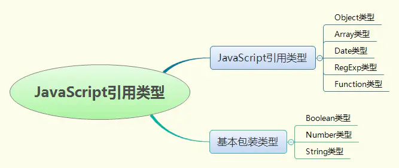

# JavaScript引用类型

引用类型的值（对象）是引用类型的一个实例。引用类型有时候也被称为对象定义，因为它们描述的是一类对象所具有的属性和方法。<br/>
对象是某个特定引用类型的实例。新对象是使用new操作符后跟一个构造函数来创建的。 构造函数本身就是一个函数，只不过该函数是出于创建新对象的目的而定义的。<br/>

```js
// 创建了 Object 引用类型的一个新实例，然后把该实例保存在了变量 person 中
// 使用的构造函数是 Object，它只为新对象定义了默认的属性和方法。
var person = new Object();
```

大致地把JavaScript对象划分成“引用类型”、“基本包装类型”和“内置对象”三块内容。

<!-- <br/> -->

## 一、Object 类型

创建 Object 实例的方式有两种:
1. 使用 new 操作符后跟 Object 构造函数

```js
var person = new Object(); 
person.name = "Nicholas"; 
person.age = 29;
```
2. 使用对象字面量表示法

```js
var person = { 
    name : "Nicholas", 
    age : 29 
}; 

var person1 = {};         //与 new Object()相同 
person1.name = "Nicholas"; 
person1.age = 29;
```

### 使用
1. 遍历 keys(obj) values(obj) entries(obj)
2. 判断对象里是不是所有对象都为空
```js
const applyData = {
    name: '',
    age: ''
}

let result = !Object.values(report).every(item => item === '')
console.log(result)
```

## 二、Array 类型

除了 Object 之外，Array 类型恐怕是 ECMAScript 中最常用的类型了；数组的每一项可以保存任何类型的数据；数组的大小是可以动态调整的，即可以随着数据的添加自动增长以容纳新增数据。<br/>

### (1)数组的创建
1. 使用Array构造函数的方式
```js
new Array();  // 创建一个数组
new Array([size]);  // 创建一个数组并指定长度，注意不是上限，是长度
new Array(element0, element1, ..., elementn);  // 创建一个数组并赋值

const array = new Array();
array[0] = '1';
```
2. 采用字面量的方法
```js
const array = []; //创建一个空数组
const array2 = [1, 2, 3]; //创建一个有三个元素的数组
```
在使用数组字面量表示法时，不会调用Array构造函数。

### (2)数组自带属性
```js
constructor // 返回创建数组对象的原型函数
length // 返回数组对象的长度
prototype // 可以增加数组的原型方法和属性
```

### (3)检测是否为数组
1. 使用instanceof方法<br/>
instanceof 用于判断一个变量是否是某个对象的实例<br/>
```js
const array = new Array();
array instanceof Array; //true
```

2. 使用constructor属性<br/>
constructor 属性返回对创建此对象的数组函数的引用，就是返回对象相对应的构造函数<br/>
```js
const array = new Array();
array.constructor === Array; // true
```

3. 使用isArray()方法<br/>
对支持isArray的浏览器,直接使用isArray方法。<br/>
```js
const array = new Array();
Array.isArray(array); //true
```
如果浏览器不支持Array.isArray()则需进行必要判断。
```js
/**
 * 判断一个对象是否是数组，参数不是对象或者不是数组，返回false
 *
 * @param {Object} arg 需要测试是否为数组的对象
 * @return {Boolean} 传入参数是数组返回true，否则返回false
 */
function isArray(arg) {
    if (typeof arg === 'object') {
        return Object.prototype.toString.call(arg) === '[object Array]';
    }
    return false;
}
```

### (4) 数组元素的增加与删除
1. array.push(e1, e2, ...eN) 将一个或多个元素添加到数组的末尾，并返回新数组的长度。<br/>
2. array.unshift(e1, e2, ...eN)将一个或多个元素添加到数组的开头，并返回新数组的长度。<br/>
3. array.pop()从数组中删除最后一个元素，并返回最后一个元素的值，原数组的最后一个元素被删除。数组为空时返回undefined。<br/>
4. array.shift()删除数组的第一个元素，并返回第一个元素，原数组的第一个元素被删除。数组为空时返回undefined。<br/>
5. array.splice(start[, deleteCount, item1, item2, ...])从数组中添加/删除元素，返回值是由被删除的元素组成的一个新的数组，如果只删除了一个元素，则返回只包含一个元素的数组。如果没有删除元素，则返回空数组。<br/><br/>
start 指定修改的开始位置（从0计数）。如果超出了数组的长度，则从数组末尾开始添加内容；如果是负值，则表示从数组末位开始的第几位（从1计数）。<br/>
deleteCount (可选)，从start位置开始要删除的元素个数。如果 deleteCount 是 0，则不移除元素。这种情况下，至少应添加一个新元素。如果deleteCount大于start之后的元素的总数，则从start后面的元素都将被删除（含第 start 位）。<br/>
item1, item2, …(可选)，要添加进数组的元素,从start位置开始。如果不指定，则 splice() 将只删除数组元素。<br/>

```js
const array = [1, 2, 3, 4, 5];

const deleted = array.splice(2, 0, 6); // 在索引为2的位置插入6
// array 变为 [1, 2, 6, 3, 4, 5]; deleted为[]
```

### (5) 数组与字符串的相互转化

### (6)数组的截取和合并
1. 数组的截取 - array.slice(start, end) 方法<br/>
slice()通过索引位置，从数组中返回start下标开始，直到end下标结束（不包括）的新数组，该方法不会修改原数组，只是返回一个新的子数组。<br/>

start (必填)，设定新数组的起始位置（下标从0开始算起）；如果是负数，则表示从数组尾部开始算起（-1 指最后一个元素，-2 指倒数第二个元素，以此类推）。<br/>
end (可选)，设定新数组的结束位置；如果不填写该参数，默认到数组结尾；如果是负数，则表示从数组尾部开始算起（-1 指最后一个元素，-2
指倒数第二个元素，以此类推）。<br/>

```js
// 获取仅包含最后一个元素的子数组
let array = [1,2,3,4,5];
array.slice(-1); // [5]

// 获取不包含最后一个元素的子数组
let array2 = [1,2,3,4,5];
array2.slice(0, -1); // [1,2,3,4]
```

该方法并不会修改数组，而是返回一个子数组。如果想删除数组中的一段元素，应该使用方法 array.splice()。<br/>

2. 数组的合并 - array.concat([item1[, item2[, . . . [,itemN]]]])方法<br/>
conact()是将多个数组（也可以是字符串，或者是数组和字符串的混合）连接为一个数组，返回连接好的新的数组。<br/>

```js
const array = [1,2].concat(['a', 'b'], ['name']);
// [1, 2, "a", "b", "name"]
```

### (7) 数组的遍历与迭代
1. array.filter(callback, thisArg)方法使用指定的函数测试所有元素,并创建一个包含所有通过测试的元素的新数组。<br/>
2. array.every(callback[, thisArg])方法检测数组中的每一个元素是否都通过了callback测试，全部通过返回true，否则返回false。<br/>
3. array.some(callback[, thisArg])判断数组中是否包含可以通过callback测试的元素，与every不同的是，这里只要某一个元素通过测试，即返回true。callback定义同上。<br/>
4. array.map(callback[, thisArg])方法返回一个由原数组中的每个元素调用callback函数后的返回值组成的新数组。<br/>

```js
let a = [1, 2, 3, 4, 5];

let bb = [];
a.map((item) => {
    if (item > 3) {
        bb.push(item);
    }
});
```
5. array.forEach(callbak)为数组的每个元素执行对应的方法。
```js
// callback定义如下： element:当前元素值；index：当前元素下标； array:当前数组

let a = [1, 2, 3, 4, 5];

let b = [];
a.forEach((item) => {
    b.push(item + 1);
});
console.log(b); // [2,3,4,5,6]
```
参考链接：https://www.jianshu.com/p/e1b43e56de08


## JavaScript引用类型之Function类型

每个函数都是Function类型的实例，而且都与其他引用类型一样具有属性和方法。由于函数是对象，因此函数名实际上也是一个指向函数对象的指针，不会与某个函数绑定。<br/>
https://www.jianshu.com/p/4b97ce098a61


## 基本包装类型

为了便于操作基本数据类型，ECMAScript还提供了3个特殊的引用数据类型：Boolean、Number和String。<br/>
在实际中，我们每读取一个基本数据值的时候，后台就会创建一个对应的基本包装类型对象，从而让我们能够调用一些方法操作这些数据。<br/>
https://www.jianshu.com/p/067a094996dd

