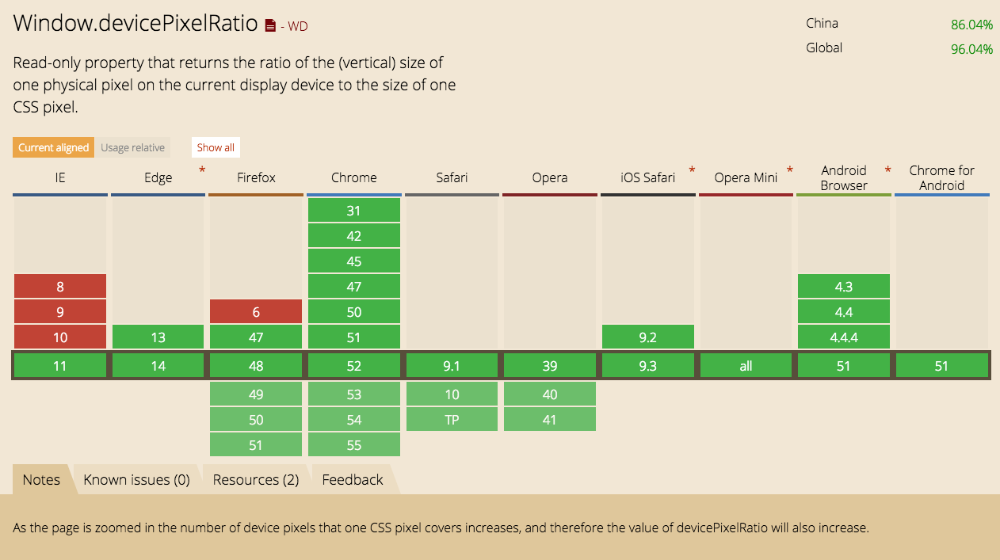

# 性能优化

## 首屏加载优化

1. Vue-Router路由懒加载（利用Webpack的代码切割）
2. 使用CDN加速，将通用的库从vendor进行抽离
3. Nginx的gzip压缩
4. Vue异步组件
5. 服务端渲染SSR
6. 如果使用了一些UI库，采用按需加载
7. Webpack开启gzip压缩
8. 如果首屏为登录页，可以做成多入口
9. Service Worker缓存文件处理
10. 使用link标签的rel属性设置 prefetch（这段资源将会在未来某个导航或者功能要用到，但是本资源的下载顺序权重比较低，prefetch通常用于加速下一次导航）、preload（preload将会把资源的下载顺序权重提高，使得关键数据提前下载好，优化页面打开速度）

<!-- ### 1、JS/CSS/HTML压缩


```js

```

::: warning 注意
1、window的屏幕像素密度不一定是整数，mac浏览器缩放之后，屏幕像素密度也不是整数。所以获取dpr一定要取整：dpr = Math.round(window.devicePixelRatio || 1);。<br/>
2、ratio = [1, 1, 1.5, 2, 2, 2]表示：1倍屏使用1倍图，2倍屏使用1.5倍图，3倍屏以上都用2倍图。这儿的规则可以按实际情况来设置。<br/>
3、webp优化更适合托管到第三方的图片，简单修改参数就可以获取不同的图片。<br/>
:::

 -->

