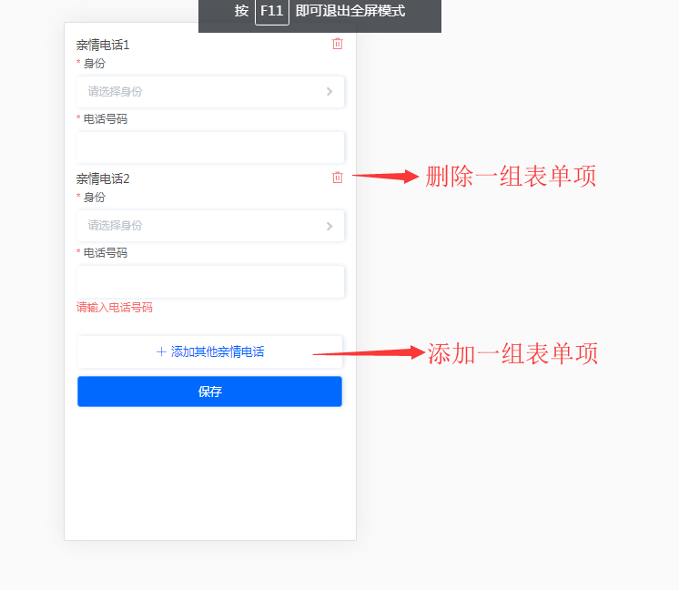
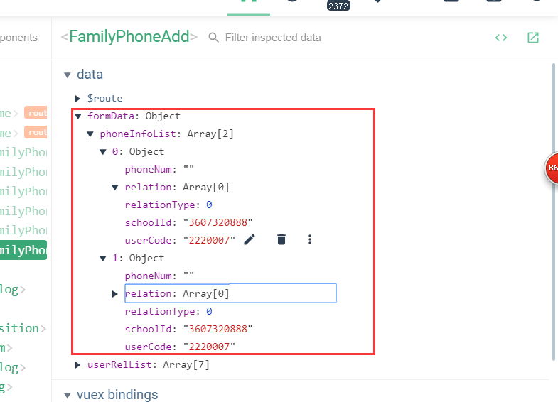
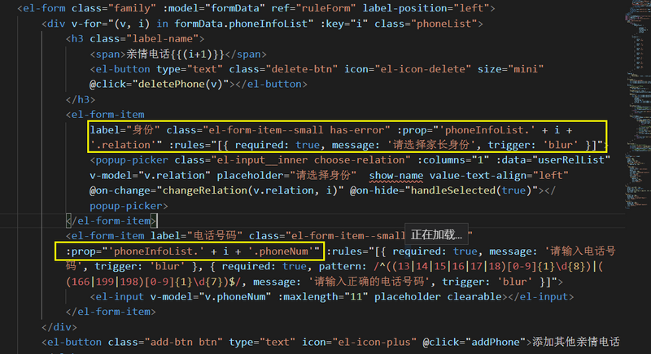
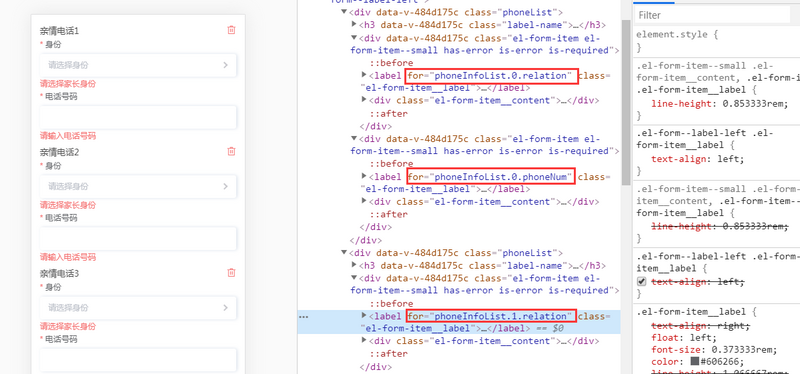

# element-ui学习
## 表单校验
### 方法一：表单上加rules对象
```html
<el-form class="apply-form first-form" :model="formData" :rules="rule" ref="form">
    <el-form-item label="姓名" prop="visitorName">
        <el-input v-model="formData.visitorName" placeholder="请输入姓名" clearable></el-input>
    </el-form-item>
    <el-form-item label="身份证号" prop="cardCode">
       <el-input v-model="formData.cardCode" :maxlength="18" placeholder="请输入身份证号" clearable></el-input>
    </el-form-item>
</el-form>
```

这种方式需要在data()中写入rule{},对于需要校验字段prop中的如visitorName写上验证规则，如下：

```js
data() {
  return {
    formData: {
      visitorName: '',
      cardType: 1,
      cardCode: ''
    },
    rule: {
      visitorName: [
        { required: true, message: '请输入姓名', trigger: 'blur' },
        { min: 2, max: 10, message: '长度在 2 到 10 个字符', trigger: 'blur' },
        {
          required: true,
          pattern: /^[\u4e00-\u9fa5_a-zA-Z0-9.·-]+$/,
          message: '姓名不支持特殊字符',
          trigger: 'blur'
        }
      ],
      cardCode: [
        { required: true, message: '请输入身份证号', trigger: 'blur' },
        { min: 15, max: 18, message: '请如实填写18位号码，以供学校保卫科核对', trigger: 'blur' },
        {
          required: true,
          pattern: /(^\d{15}$)|(^\d{18}$)|(^\d{17}(\d|X|x)$)/,
          message: '请输入正确的身份证号码',
          trigger: 'blur'
      ]
    }
  }
}
```

其中对于有些需要自定义的校验规则可以作为变量写在data中：

```js
data() {
  let reg = /(?!^(\d+|[a-zA-Z]+|[~!@#$%^&*?]+)$)^[\w~!@#$%^&*?]{6,12}$/
  var validateNewPwd = (rule, value, callback) => {
    if (!reg.test(value)) {
      callback(new Error('密码应是6-12位数字、字母或字符！'))
    } else if (this.form.oldPasswd === value) {
      callback(new Error('新密码与旧密码不可一致！'))
    } else {
      callback()
    }
  }
  var validateComfirmPwd = (rule, value, callback) => {
    if (!reg.test(value)) {
      callback(new Error('密码应是6-12位数字、字母或字符！'))
    } else if (this.form.newPasswd !== value) {
      callback(new Error('确认密码与新密码不一致！'))
    } else {
      callback()
    }
  }
  return {
    form: {
      newPasswd: '',
      comfirmPwd: ''
    },
    rules: {
      newPasswd: [
        { required: true, message: '请输入新密码', trigger: 'blur' },
        { validator: validateNewPwd, trigger: 'blur' }
      ],
      comfirmPwd: [
        { required: true, message: '请输入确认密码', trigger: 'blur' },
        { validator: validateComfirmPwd, trigger: 'blur' }
      ]
    }
  }
}
```

比较适用于<b>表单全部字段校验或需要校验字段类型比较简单</b>的数据类型

### 方法二：在el-form-item单个添加

```html
<el-form-item label="电话号码" class="el-form-item--small has-error" :prop="phoneNum" :rules="[{ required: true, message: '请输入电话号码', trigger: 'blur' }, { required: true, pattern: /^((13|14|15|16|17|18)[0-9]{1}\d{8})|((166|199|198)[0-9]{1}\d{7})$/, message: '请输入正确的电话号码', trigger: 'blur' }]">
  <el-input v-model="v.phoneNum" :maxlength="11" placeholder clearable></el-input>
</el-form-item>
```

这种方式适用于需要个别检验的字段，或者表单字段有变动的校验

### 方法三：动态增减表单项

先看需求效果图



对应的数据结构：



对应删除增加表单项的操作为：

```js
addPhone() {
    let len = this.formData.phoneInfoList.length
    this.$set(this.formData.phoneInfoList, len, {
        relation: [],
        phoneNum: '',
        relationType: 0,
        schoolId: this.selectedUser.schoolId,
        userCode: this.selectedUser.userCode
    })
},
deletePhone(item) {
    if (this.formData.phoneInfoList.length > 1) {
        // 表示先获取这个元素的下标，然后从这个下标开始计算，删除长度为1的元素
        this.formData.phoneInfoList.splice(this.formData.phoneInfoList.indexOf(item), 1);
    } else {
        this.$vux.toast.text('至少保留一个家长亲情号码！')
        return false
    }
},
```

这样的rule、prop直接写就对应不上表单mode绑定的对象上的属性，所以在此要用循环的方式找到要校验的字段所在数据中的索引，然后再以字符串拼接的方式连上校验字段名称：



渲染出来的html为：


