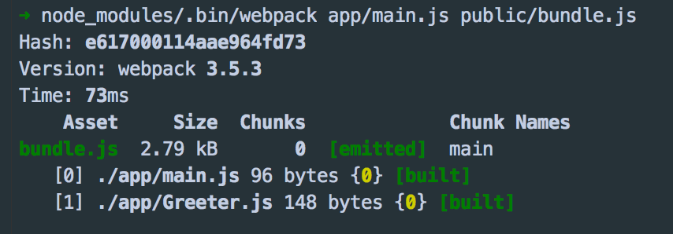
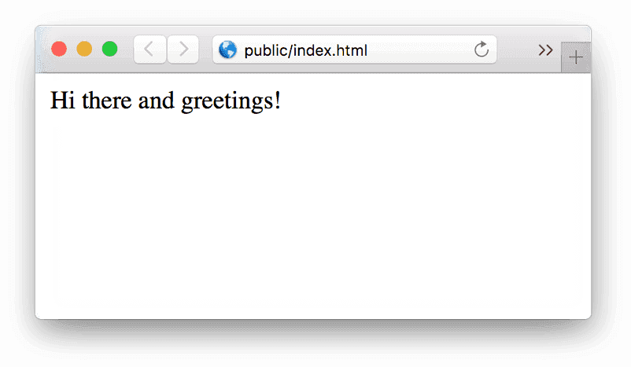
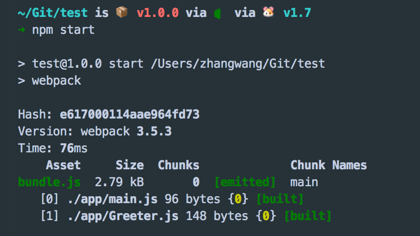
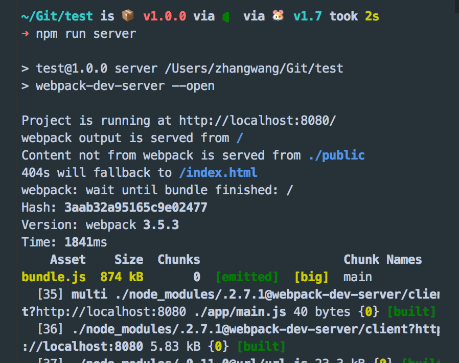

# webpack学习-小雷

## 正式使用Webpack

webpack可以在终端中使用，在基本的使用方法如下：<br/>
```js
# {extry file}出填写入口文件的路径，本文中就是上述main.js的路径，
# {destination for bundled file}处填写打包文件的存放路径
# 填写路径的时候不用添加{}
webpack {entry file} {destination for bundled file}
```

指定入口文件后，webpack将自动识别项目所依赖的其它文件，不过需要注意的是如果你的webpack不是全局安装的，那么当你在终端中使用此命令时，需要额外指定其在node_modules中的地址，继续上面的例子，在终端中输入如下命令<br/>
```js
# webpack非全局安装的情况
node_modules/.bin/webpack app/main.js public/bundle.js
```
<br/>
结果如下<br/>
<br/>
可以看出webpack同时编译了main.js 和Greeter,js,现在打开index.html,可以看到如下结果<br/>
<br/>
有没有很激动，已经成功的使用Webpack打包了一个文件了。不过在终端中进行复杂的操作，其实是不太方便且容易出错的，接下来看看Webpack的另一种更常见的使用方法。<br/>

### 通过配置文件来使用Webpack
Webpack拥有很多其它的比较高级的功能（比如说本文后面会介绍的loaders和plugins），这些功能其实都可以通过命令行模式实现，但是正如前面提到的，这样不太方便且容易出错的，更好的办法是定义一个配置文件，这个配置文件其实也是一个简单的JavaScript模块，我们可以把所有的与打包相关的信息放在里面。<br/><br/>
继续上面的例子来说明如何写这个配置文件，在当前练习文件夹的根目录下新建一个名为webpack.config.js的文件，我们在其中写入如下所示的简单配置代码，目前的配置主要涉及到的内容是入口文件路径和打包后文件的存放路径。<br/>
```js
module.exports = {
  entry:  __dirname + "/app/main.js",//已多次提及的唯一入口文件
  output: {
    path: __dirname + "/public",//打包后的文件存放的地方
    filename: "bundle.js"//打包后输出文件的文件名
  }
}
```
::: warning 注意
注：“__dirname”是node.js中的一个全局变量，它指向当前执行脚本所在的目录。
:::
有了这个配置之后，再打包文件，只需在终端里运行webpack(非全局安装需使用node_modules/.bin/webpack)命令就可以了，这条命令会自动引用webpack.config.js文件中的配置选项，示例如下：<br/>
<br/>
又学会了一种使用Webpack的方法，这种方法不用管那烦人的命令行参数，有没有感觉很爽。如果我们可以连webpack(非全局安装需使用node_modules/.bin/webpack)这条命令都可以不用，那种感觉会不会更爽~，继续看下文。<br/>

### 更快捷的执行打包任务
在命令行中输入命令需要代码类似于node_modules/.bin/webpack这样的路径其实是比较烦人的，不过值得庆幸的是npm可以引导任务执行，对npm进行配置后可以在命令行中使用简单的npm start命令来替代上面略微繁琐的命令。在package.json中对scripts对象进行相关设置即可，设置方法如下。<br/>
```js
{
  "name": "webpack-sample-project",
  "version": "1.0.0",
  "description": "Sample webpack project",
  "scripts": {
    "start": "webpack" // 修改的是这里，JSON文件不支持注释，引用时请清除
  },
  "author": "zhang",
  "license": "ISC",
  "devDependencies": {
    "webpack": "3.10.0"
  }
}
```
::: warning 注意
package.json中的script会安装一定顺序寻找命令对应位置，本地的node_modules/.bin路径就在这个寻找清单中，所以无论是全局还是局部安装的Webpack，你都不需要写前面那指明详细的路径了。
:::
npm的start命令是一个特殊的脚本名称，其特殊性表现在，在命令行中使用npm start就可以执行其对于的命令，如果对应的此脚本名称不是start，想要在命令行中运行时，需要这样用npm run {script name}如npm run build，我们在命令行中输入npm start试试，输出结果如下：<br/>
<br/>
现在只需要使用npm start就可以打包文件了，有没有觉得webpack也不过如此嘛，不过不要太小瞧webpack，要充分发挥其强大的功能我们需要修改配置文件的其它选项，一项项来看。<br/>
