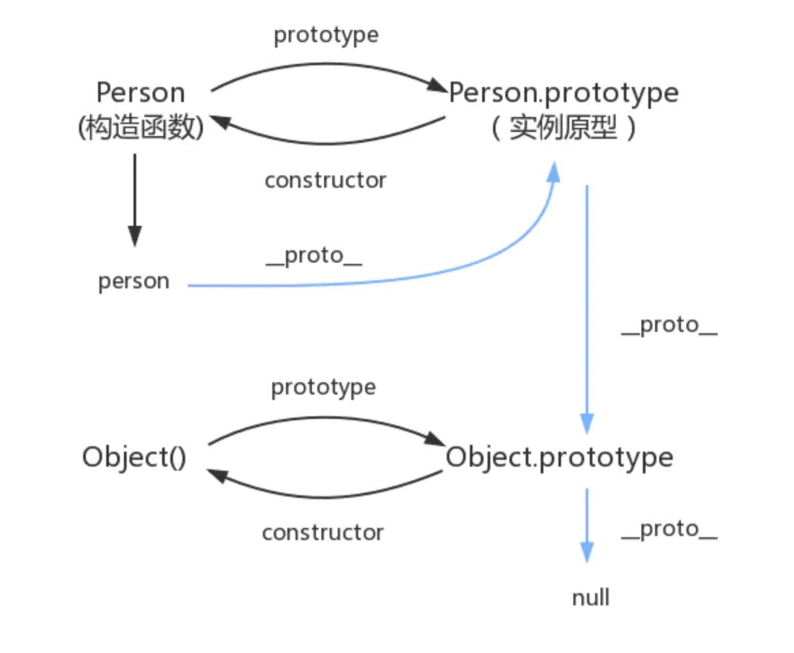

# 框架相关知识点

## 虚拟dom的概念

### dom本质
浏览器的概念，用js对象来表示页面上的元素，并提供了操作dom对象的API

### DOM树的概念
一个网页的呈现过程：<br/>
1、浏览器请求服务器获取页面HTML代码<br/>
2、浏览器在内存中，解析dom结构，并在浏览器内存中渲染出一颗dom树。<br/>
3、浏览器把dom树，呈现在页面上。<br/>

### 虚拟dom
指的是用js对象的形式，来模拟页面上Dom嵌套关系。（以js对象的形式存在的）<br/>
例如：
```html
<div id="name" title= "name">
ccccc 
<p>dhhhh</p>
</div>
```
文本也属于子节点<br/>
模拟dom为：<br/>
```js
var div = {
  tagName: 'div',
  attrs:{
    id: "name" ，
    title: "name"   
},
childrens: [
  'ccccc',
    {
      tagName: 'p',
      attrs:{},
      childrens: [
          'dhhhh',
      ]
    }
]
}
```

### dom和虚拟dom的区别
dom：浏览器中提供的概念，用JS对象表示页面上的元素，并提供了操作元素的api。<br/>
虚拟dom：框架中的概念，是开发框架的程序猿手动用js对象来模拟dom元素和嵌套关系。<br/>
本质： 用就是对象来模拟dom元素和嵌套关系<br/>
目的： 实现页面元素的高效更新。<br/>

### Diff算法
tree diff:新旧两棵dom树，dom层逐级对比完毕，则所有需要被按需更新的元素，必然能够找到。<br/>
component diff:在进行tree diff的时候，每一层中组件级别的对比，叫做component diff,<br/>
如果对比前后组件类型相同，则暂时认为此组件不需要被更新；<br/>
如果对比前后组件类型不同，则需要移除旧组件，创建新组件，并追加到页面上。<br/>
element diff 在进行组件对比的时候，如果两个组件类型相同，则需要进行元素级别的对比。<br/>
<br/>
详细参考：<br/>
https://www.jianshu.com/p/5a5d3195b70c<br/>

## vue中使用v-for时为什么不能用index作为key
结论：<br/>
更新DOM的时候会出现性能问题<br/>
会发生一些状态bug<br/>
React 中的 key 也是如此<br/><br/>
<b>为什么要用key？</b><br/>
Vue 和 React 都实现了一套虚拟DOM，使我们可以不直接操作DOM元素，只操作数据便可以重新渲染页面。而隐藏在背后的原理便是其高效的Diff算法。<br/>
Vue 和 React 的虚拟DOM的Diff算法大致相同，其核心是基于两个简单的假设：<br/>
1. 两个相同的组件产生类似的DOM结构，不同的组件产生不同的DOM结构。<br/>
2. 同一层级的一组节点，他们可以通过唯一的id进行区分。<br/>
基于以上这两点假设，使得虚拟DOM的Diff算法的复杂度从O(n^3)降到了O(n)。<br/><br/>

当页面的数据发生变化时，Diff算法只会比较同一层级的节点：<br/>
如果节点类型不同，直接干掉前面的节点，再创建并插入新的节点。<br/>
如果节点类型相同，则会重新设置该节点的属性，从而实现节点的更新。<br/>
总而言之，key的作用主要是为了高效的更新虚拟DOM 。另外vue中在使用相同标签名元素的过渡切换时，也会使用到key属性，其目的也是为了让vue可以区分它们，否则vue只会替换其内部属性而不会触发过渡效果。<br/>

参考来源：https://blog.csdn.net/aihuanhuan110/article/details/98223011<br/>


## 单页应用与多页应用
单页应用：一个项目中只有一个完整的html页面，其他的都是部分的html片段组成。页面跳转只是局部刷新，不会重新加载全部资源。片段之间的切换快，比较容易实现转场动画。<br/>
<br/>

## 前端路由hash、history原理及简单的实践下
路由是根据不同的url地址来显示不同的页面或内容的功能，这个概念很早是由后端提出的。<br/>
那么既然有后端路由，那为什么还需要我们前端路由呢？后端路由有一个很大的缺点就是每次路由切换的时候都需要去刷新页面，然后发出ajax请求，然后将请求数据返回回来，那么这样每次路由切换都要刷新页面对于用户体验来说就不好了。因此为了提升用户体验，我们前端路由就这样产生了。它就可以解决浏览器不会重新刷新了。<br/>
### hash模式
hash路由模式是这样的：http://xxx.abc.com/#/xx。 有带#号，后面就是hash值的变化。改变后面的hash值，它不会向服务器发出请求，因此也就不会刷新页面。并且每次hash值发生改变的时候，会触发hashchange事件。因此我们可以通过监听该事件，来知道hash值发生了哪些变化。比如我们可以如下简单的监听：<br/>
```js
function hashAndUpdate () {
   // todo 匹配 hash 做 dom 更新操作
}

window.addEventListener('hashchange', hashAndUpdate);
```
### history模式
HTML5的History API为浏览器的全局history对象增加了该扩展方法。它是一个浏览器的一个接口，在window对象中提供了onpopstate事件来监听历史栈的改变，只要历史栈有信息发生改变的话，就会触发该事件。提供了如下事件：<br/>
```js
window.addEventListener('popstate', function(e) {
  console.log(e)
});
```
参考来源：https://www.cnblogs.com/tugenhua0707/p/10859214.html<br/>

## 多个组件之间如何拆分各自的state，每块小的组件有自己的状态，它们之间还有一些公共的状态需要维护，如何思考这块
状态提升，找到容器组件和展示组件，保证唯一数据源和单向数据<br/>
对于组件的拆分还要做到高内聚低耦合<br/>

## 数组对象更新
```js
Vue.set(item[0], 'description', finalStr);  // （arr/obj, name, newvalue) 数组或对象可以具体到某一项
```


