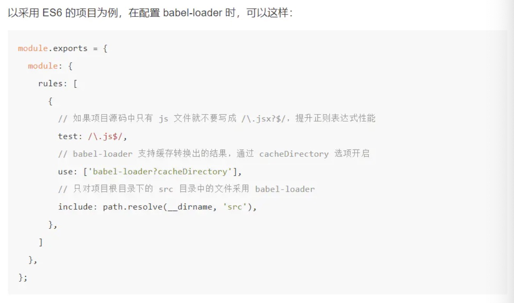
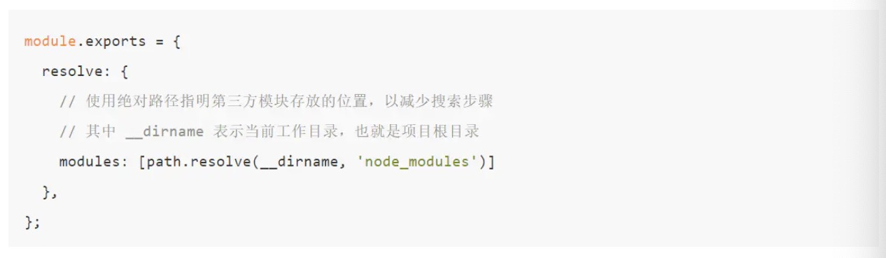

# webpack相关的性能优化
## 前言

Webpack优化可以分为<b>优化开发体验</b>和<b>优化输出质量</b>两部分

### 优化开发体验

优化开发体验的目的是为了提升开发时的效率，其中又可以分为以下几点：

#### 优化构建速度
在项目庞大时构建耗时可能会变的很长，每次等待构建的耗时加起来也会是个大数目。

##### 缩小文件搜索范围
1. 在配置 Loader 时通过 include 去缩小命中范围

2. 优化 resolve.modules 配置，指明存放第三方模块的绝对路径，以减少寻找，配置如下：

3. 优化 resolve.mainFields 配置

4. 优化 resolve.alias 配置

5. 优化 resolve.extensions 配置
在配置 resolve.extensions 时你需要遵守以下几点，以做到尽可能的优化构建性能：

* 后缀尝试列表要尽可能的小，不要把项目中不可能存在的情况写到后缀尝试列表中。
* 频率出现最高的文件后缀要优先放在最前面，以做到尽快的退出寻找过程。
* 在源码中写导入语句时，要尽可能的带上后缀，从而可以避免寻找过程。例如在你确定的情况下把 require('./data') 写成 require('./data.json')。

6. 优化 module.noParse 配置

##### 使用 DllPlugin
为什么给 Web 项目构建接入 动态链接库 的思想后，会大大提升构建速度呢？ 原因在于包含大量复用模块的动态链接库只需要编译一次，在之后的构建过程中被动态链接库包含的模块将不会在重新编译，而是直接使用动态链接库中的代码。 由于动态链接库中大多数包含的是常用的第三方模块，例如 react、react-dom，只要不升级这些模块的版本，动态链接库就不用重新编译。

##### 使用 HappyPack
在整个 Webpack 构建流程中，最耗时的流程可能就是 Loader 对文件的转换操作了，因为要转换的文件数据巨多，而且这些转换操作都只能一个个挨着处理。（运行在 Node.js 之上的 Webpack 是单线程模型的）

HappyPack的核心原理就是把这部分任务分解到多个进程去并行处理，从而减少了总的构建时间。

##### 使用 ParallelUglifyPlugin
ParallelUglifyPlugin 会开启多个子进程，把对多个文件的压缩工作分配给多个子进程去完成，每个子进程其实还是通过 UglifyJS去压缩代码，但是变成了并行执行。 所以 ParallelUglifyPlugin 能更快的完成对多个文件的压缩工作。

#### 优化使用体验
通过自动化手段完成一些重复的工作，让我们专注于解决问题本身。

##### 使用自动刷新
使用 webpack 模块负责监听文件，webpack-dev-server 模块则负责刷新浏览器。

##### 开启模块热替换

#### 优化输出质量

优化输出质量的目的是为了给用户呈现体验更好的网页，例如减少首屏加载时间、提升性能流畅度等。 这至关重要，因为在互联网行业竞争日益激烈的今天，这可能关系到你的产品的生死。

优化输出质量本质是优化构建输出的要发布到线上的代码，分为以下几点：

##### 减少用户能感知到的加载时间，也就是首屏加载时间
1. 区分环境
2. 压缩代码
3. CDN加速
4. 使用Tree Shaking
Tree Shaking 可以用来剔除 JavaScript 中用不上的死代码（没用到的代码）。它依赖静态的 ES6 模块化语法，例如通过 import 和 export 导入导出。

5. 提取公共代码
6. 按需加载

##### 提升流畅度，也就是提升代码性能
1. 使用 Prepack
2. 开启 Scope Hoisting

## 多线程打包
这是打包速度方面的优化

webpack默认使用uglify进行打包，是单线程的打包模式，可以使用异步的加载方式，happypack、parellelUglify多线程运行。

备注：可以结合路由懒加载的方式

## 缓存

## 分包
使用splitchunks进行代码的拆分。

dllplugin，将不经常变化的框架打包到dll中

备注：也可以将不常变动的第三方库使用cdn的方式引入，写在script标签中，并且在webpack的配置文件中，配置external，webpack在打包的时候就不会打包进去

## vue项目部署优化之map文件

### dist中“大”文件----map

为优化前的dist文件大小，将近40m，部署发布时间超过3分30秒。很多和js文件同名的map后缀文件，size都很大。

### map是个什么玩意
source map文件是js文件压缩后，文件的变量名替换对应、变量所在位置等元信息数据文件，一般这种文件和min.js主文件放在同一个目录下。 比如压缩后原变量是map，压缩后通过变量替换规则可能会被替换成a，这时source map文件会记录下这个mapping的信息，这样的好处就是说，在调试的时候，如果有一些JS报错，那么浏览器会通过解析这个map文件来重新merge压缩后的js,使开发者可以用未压缩前的代码来调试，这样会给我们带来很大的方便！

而这种还原性调试功能，目前只有chorme才具有。

一句话，就是压缩的js与未压缩源文件js之间的映射关系文件。（就是一个桥梁）

so

这玩意就是辅助我调试用的，正式站其实作用不大，而且处于安全考虑，可以直接干掉。

### 如何优化
因为我是基于vue-cli3构建的项目，所以在vue.config.js文件中，添加productionSourceMap: false即可；之后直接编译 npm run  build 就可以看到效果

